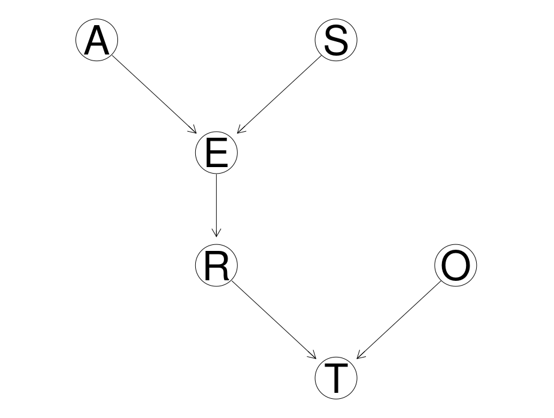
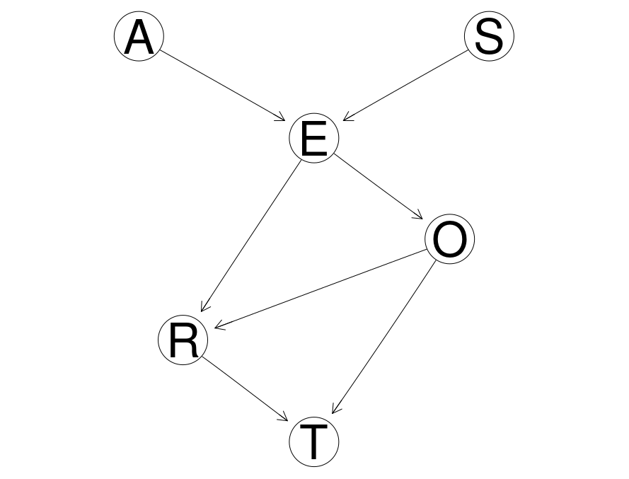
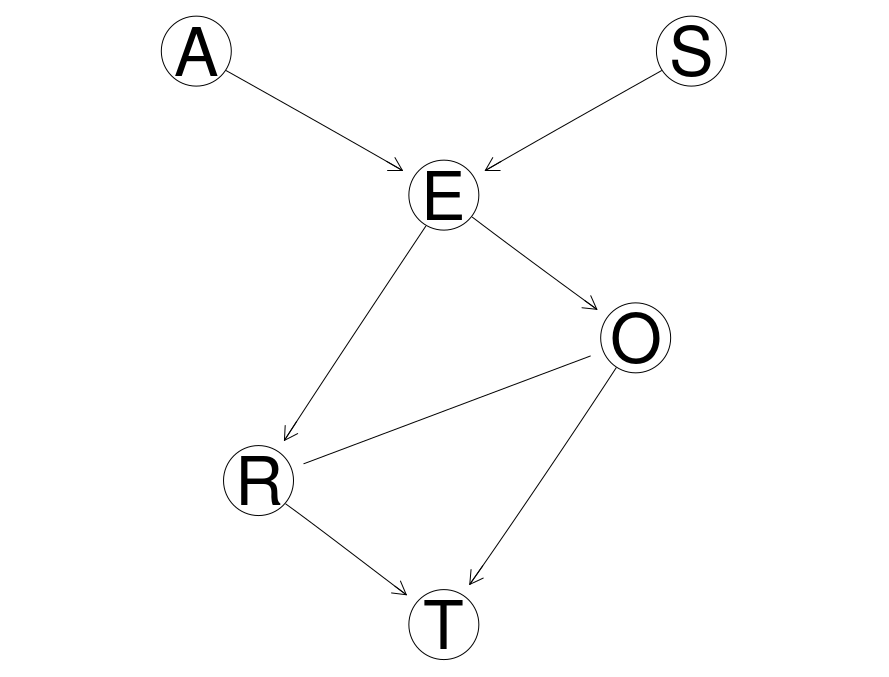

# Causal Inference Course: Homework 1
*Dan Saattrup Nielsen, July 2020*

This homework concerns building generative models, both Bayesian networks using `bnlearn` in `R`, and probabilistic programming using `pyro` in `Python`.

Our data is the survey data, containing the following categorical variables:

  - **Age (A)**: The age of the individual, which is *young* (**young**) if they'reless than 30 years old, *adult* (**adult**) if they're between 30 and 60 years old, and *old* (**old**) otherwise
  - **Sex (S)**: The biological sex of the individual, which here is assumed to be binary: *male* (**M**) or *female* (**F**)
  - **Education (E)**: The highest level of education completed by the individual, which can be *high school* (**high**) or *university degree* (**uni**)
  - **Occupation (O)**: Whether the individual is an *employee* (**emp**) or is *self employed* (**self**)
  - **Residence (R)**: The size of the city the individual lives in, which can be either *small* (**small**) or *big* (**big**)
  - **Travel (T)**: The means of transport favoured by the individual, recorded as *car* (**car**), *train* (**train**) or *other* (**other**)

Here travel is the target of the survey. We're using the following DAG as our model of the generative process of the data:


## Question 1: Building a DAG

### 1.1
We can write out the factorisation of the joint distribution of our model as follows, which is derived from our DAG as the individual nodes conditioned on the nodes parents:

$$
P(A, S, E, O, R, T) = P(A)P(S)P(E|A, S)P(O|E)P(R|E)P(T|O, R)
$$

### 1.2
In `bnlearn`'s string representation, we can write this as

$$
[A][S][E|A:S][O|E][R|E][T|O:R]
$$

### 1.3
From the above string representation, we can build the DAG in `bnlearn` as follows:

```r
> dag <- bnlearn::model2network('[A][S][E|A:S][O|E][R|E][T|O:R]')
```

### 1.4
We can get the class of the DAG using the `class` function:

```r
> class(dag)
"bn"
```

### 1.5
Using the `Rgraphviz` library, we can produce a plot of the DAG:
```r
> graphviz.plot(dag)
```

This produces the DAG as pictured in the beginning of this document.


## Question 2: Experimenting with graph utilities

### 2.1
We can extract the nodes and arcs of the DAG from Question 1 as follows:

```r
> nodes <- bnlearn::nodes(dag)
> nodes
[1] "A" "E" "O" "R" "S" "T"

> arcs <- bnlearn::arcs(dag)
> arcs
     from to 
[1,] "A"  "E"
[2,] "S"  "E"
[3,] "E"  "O"
[4,] "E"  "R"
[5,] "O"  "T"
[6,] "R"  "T"
```

### 2.2
We can also get the parents and children of each node as follows:

```r
> bnlearn::parents(dag, 'A')
character(0)
> bnlearn::children(dag, 'A')
[1] "E"

> bnlearn::parents(dag, 'E')
[1] "A" "S"
> bnlearn::children(dag, 'E')
[1] "O" "R"

> bnlearn::parents(dag, 'O')
[1] "E"
> bnlearn::children(dag, 'O')
[1] "T"

> bnlearn::parents(dag, 'R')
[1] "E"
> bnlearn::children(dag, 'R')
[1] "T"

> bnlearn::parents(dag, 'S')
character(0)
> bnlearn::children(dag, 'S')
[1] "E"

> bnlearn::parents(dag, 'T')
[1] "O" "R"
> bnlearn::children(dag, 'T')
character(0)
```

### 2.3
To extract Markov blankets of nodes, we can use the `mb` function:
```r
> bnlearn::mb(dag, 'A')
[1] "E" "S"

> bnlearn::mb(dag, 'E')
[1] "A" "O" "R" "S"

> bnlearn::mb(dag, 'T')
[1] "O" "R"
```

### 2.4
To identify a Markov blanket from a DAG at a given node, we look at the parents, children and spouses of the node (here a *spouse* is a node which is the parent of a child of the given node).

As an example, the Markov blanket of `A` is `E` and `S`, since it has no parents, `E` is the only child and `S` the only spouse.

### 2.5
If we ignore the DAG then we can still define the Markov blanket of a variable.

Here the Markov blanket of a variable $A$ is the smallest subset $M$ of random variables under consideration, such that A is independent of any variable not in $M$, conditioned on $M$.


## Question 3: Conditional probability distribution (CPD) parameter estimation

### 3.1
We now load in the data in `survey2.txt` and we estimate the parameters of our DAG using Bayesian estimation.

```r
> df <- read.table('../data/survey2.txt', header = TRUE)
> dag.fitted <- bnlearn::bn.fit(dag, df, method = 'bayes')
> class(dag.fitted)
[1] "bn.fit"    "bn.fit.dnet"
```

### 3.2
We can change the `iss` parameter in the `bn.fit` function which, according to the documentation, is "the imaginary sample size used by the `bayes` method to estimate the conditional probability tables associated with discrete nodes". It defaults to 1.

As an example, here we're fitting our models assuming that `iss` = 10:

```r
dag.fitted.newprior <- bnlearn::bn.fit(dag, df, method = 'bayes', iss = 10)
```

By checking the CPTs we see that $P(A = \text{old})$ increases from $15.8%$ to $16%$, $P(A = \text{adult})$ stays almost constant and $P(A = \text{young})$ decreases from $48.5%$ to $48.3%$.

```r
> dag.fitted['A']
$A

  Parameters of node A (multinomial distribution)

Conditional probability table:
     adult       old     young 
0.3575391 0.1578417 0.4846193

> dag.fitted.newprior['A']
$A

  Parameters of node A (multinomial distribution)

Conditional probability table:
     adult       old     young 
0.3572139 0.1601990 0.4825871 
```

To investigate why that is the case, let's look at the distribution of Age in our data:

```r
> dplyr::count(df, A)
      A   n
1 adult 236
2   old 104
3 young 320
```

A hypothesis is then that a higher `iss` value causes rarer events to be slightly more probable, and common events to be slightly less probable. By doing the same thing for another variable, say Occupation, we at least arrive at results consistent with this hypothesis.

## Question 4: Graph manipulation

### 4.1
We can create a copy of our DAG without the arc from Education to Occupation as follows.

```r
> dag2 <- bnlearn::drop.arc(dag2, 'E', 'O')
> graphviz.plot(dag2)
```



### 4.2
We can fit the parameters of our new DAG as before:

```r
dag2.fitted <- bnlearn::bn.fit(dag2, df, method = 'bayes')
```

As we might suspect, by having removed the edge from $E$ to $O$, the CPT of $O$ does not depend upon the values of $E$ anymore:

```r
> dag.fitted['O']
$O

  Parameters of node O (multinomial distribution)

Conditional probability table:
 
      E
O            high        uni
  emp  0.98016416 0.96531303
  self 0.01983584 0.03468697

> dag2.fitted['O']
$O

  Parameters of node O (multinomial distribution)

Conditional probability table:
        emp       self 
0.97352496 0.02647504 
```

One can also check that none of the other CPTs have changed by removing this edge.

## Question 5: Markov equivalence

### 5.1
We can build the associated PDAG from our original DAG as follows:

```r
> cpdag <- bnlearn::cpdag(dag)
> cpdag

  Random/Generated Bayesian network

  model:
   [A][S][E|A:S][O|E][R|E][T|O:R] 
  nodes:                                 6 
  arcs:                                  6 
    undirected arcs:                     0 
    directed arcs:                       6 
  average markov blanket size:           2.67 
  average neighbourhood size:            2.00 
  average branching factor:              1.00 

  generation algorithm:                  Empty 
```

This PDAG has no undirected arcs and thus look identical to the original DAG. This means that the Markov equivalence class containing the DAG only has one element.

We can also see this by noting that any Markov equivalent DAG has to have the same colliders, meaning that the edges into $E$ and into $T$ must stay fixed. The only other edges are $E\to O$ and $E\to R$. If any of these pointed in the other direction then we would generate new colliders, say with the $S\to E$ edge.

### 5.2
Here we create a new DAG, `dag3`, which is just like our original DAG except that we introduce a new edge $O\to R$.

```r
> dag3 <- bnlearn::set.arc(dag, 'O', 'R')
> graphviz.plot(dag3)
```



If we now compute a PDAG from this new DAG we get an undirected edge:
```r
> cpdag3 <- bnlearn::cpdag(dag3)
> graphviz.plot(cpdag3)
```


The reason why the edge between $O$ and $R$ is undirected is that we don't change the d-separations in the DAG by changing the direction of the $O\to R$ edge, since neither direction introduces a new collider, as both $(R, E)$ and $(E, O)$ are dependent pairs.

### 5.3
By the above explanation, we can create a new DAG which is Markov equivalent to `dag3`, simply by switching the direction of the $O\to R$ edge:

```r
> dag4 <- bnlearn::set.arc(dag, 'R', 'O')
> graphviz.plot(dag4)
```


We can check that it is indeed Markov equivalent to `dag3` by seeing that their PDAGs are the same:

```r
> cpdag4 <- bnlearn::cpdag(dag4)
> graphviz.plot(cpdag4)
```



### 5.4
Using the `score` function, we can calculate the log-likelihood of the data given `dag2` and `dag3`. Since they are Markov equivalent these should be identical, as Markov equivalence means that the two DAGs have exactly the same CPTs, which are all the data sees.

```r
> bnlearn::score(dag3, df)
[1] -2425.346

> bnlearn::score(dag4, df)
[1] -2425.346
```

## Question 6: Modeling and Inference using Pyro

### 6.1

